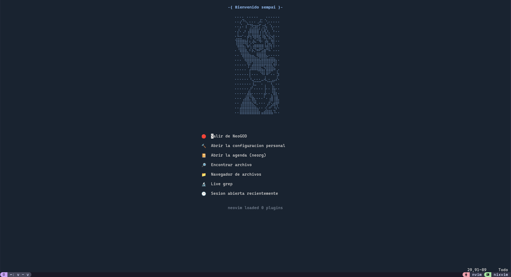
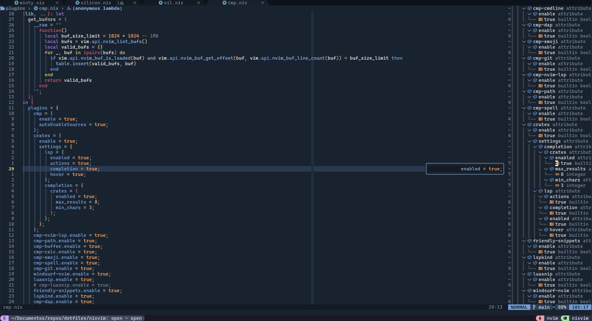
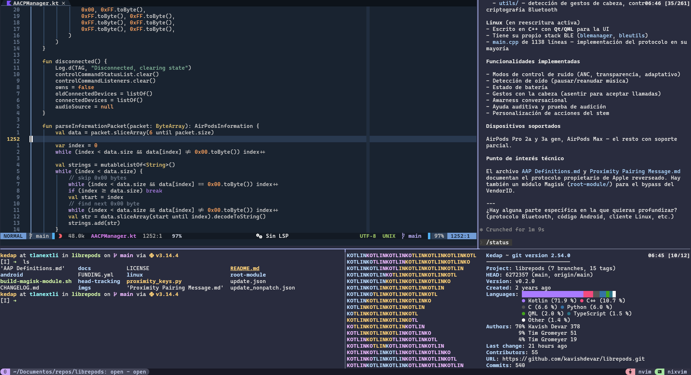

# 🚀 NixVim Kit de Kedap

¡Bienvenido! Estás ante una configuración de **Neovim** potenciada por **Nix**, diseñada para ser robusta, elegante y, sobre todo, productiva.

## 📸 Capturas de pantalla







---

## 🌟 ¿Qué hace especial a esta configuración?

Esta no es una configuración de Neovim común. Al usar **NixVim**, combinamos la flexibilidad de Neovim con la reproducibilidad de Nix:

- **Cero conflictos:** Todas las dependencias (LSP, formateadores, herramientas de sistema) se instalan automáticamente vía Nix.
- **Portabilidad total:** Si funciona en mi máquina, funcionará en la tuya exactamente igual.
- **Configuración modular:** Organizada en archivos Nix para facilitar el mantenimiento.

## 🚀 Cómo empezar

No necesitas clonar y configurar nada manualmente. Puedes probarla directamente con:

```bash
nix run github:kedap/dotfiles?dir=nixvim
```

---

## 🧩 Plugins Incluidos

Esta configuración utiliza una selección curada de plugins para ofrecer la mejor experiencia:

### 🎨 Temas disponibles

Configurables en `config/plugins/temas.nix`.

- **Gruvbox** (Activo por defecto)
- Catppuccin, TokyoNight, Nord, Rose Pine, Onedark, Kanagawa, Oxocarbon, Monokai Pro, Nightfox, Ayu.

### 🛠️ Cosas esenciales

- **nvim-tree**: Gestor de archivos lateral.
- **oil.nvim**: Edita tu sistema de archivos como un buffer de texto.
- **bufferline**: Pestañas elegantes.
- **lualine**: Barra de estado informativa y estética.
- **telescope**: El buscador definitivo (archivos, grep, marcas).
- **which-key**: Menú interactivo de atajos.

### 💻 Desarrollo y LSP

- **LSP**: Soporte para +20 lenguajes (Rust, Go, Java, Python, TS, Nix, etc.).
- **lspsaga**: Interfaz mejorada para acciones de LSP.
- **nvim-ufo**: Folds (plegado de código) inteligentes.
- **conform.nvim**: Formateo de código ultra rápido.
- **treesitter**: Resaltado de sintaxis avanzado.

### 🐞 Depuración (DAP)

- **nvim-dap**: Debugger integrado.
- **nvim-dap-ui**: Interfaz visual para depuración.
- **nvim-dap-virtual-text**: Información de variables en línea.

### 🌿 Git Power

- **neogit**: Interfaz completa para Git.
- **diffview**: Visualización de diferencias y resolución de conflictos.
- **gitsigns**: Indicadores de cambios en el margen.
- **git-conflict**: Herramienta dedicada para conflictos de merge.

### 🗄️ Base de Datos

- **vim-dadbod**: Gestión de DBs desde el editor.
- **dadbod-ui** y **completion**.

### 🎨 Utilidades y "Cosas Bonitas"

- **minty**: Selector de colores (Color picker).
- **nvim-silicon**: Genera capturas de código hermosas.
- **snacks.nvim**: Colección de utilidades modernas y rápidas.
- **dashboard-nvim**: Pantalla de inicio productiva.
- **todo-comments**: Resaltado de notas TODO/FIXME.
- **render-markdown**: Previsualización de markdown mejorada.

---

## ⌨️ Atajos de teclado (Keymaps)

Usa el **Espacio** como tecla líder (`<Leader>`).

| Teclas       | Acción                                                  |
| :----------- | :------------------------------------------------------ |
| `<Leader> f` | **Archivos** (buscar, gestor, guardar, silicon)         |
| `<Leader> c` | **Código** (renombrar, acciones, referencias, logs)     |
| `<Leader> g` | **Git** (status, diff, commits, push/pull)              |
| `<Leader> d` | **Depuración** (breakpoints, continuar, step into/over) |
| `<Leader> l` | **Encontrar** (palabras, buffers, marcas, todos)        |
| `<Leader> t` | **Terminal** (flotante, dividida, DBUI)                 |
| `<Leader> b` | **Buffers** (navegar y cerrar)                          |
| `<Leader> h` | **HTTP** (Rest client para APIs)                        |

---

## 📦 Dependencias

Gracias a Nix, casi todo es automático, pero para la mejor experiencia visual recomiendo:

1.  **Terminal**: [Kitty](https://sw.kovidgoyal.net/kitty/) (soporta imágenes y ligaduras).
2.  **Fuentes**: Una **NerdFont** es obligatoria para los iconos. Yo uso:
    - [Cascadia Code](https://github.com/microsoft/cascadia-code)
    - [Victor Mono](https://rubjo.github.io/victor-mono/)
3.  **Utilidades**: `ripgrep`, `fd`, `jq` (Nix las instala por ti al ejecutar el kit).

---

Hecho con ❤️ por Daniel. ¡Disfruta tu nuevo entorno de desarrollo!
