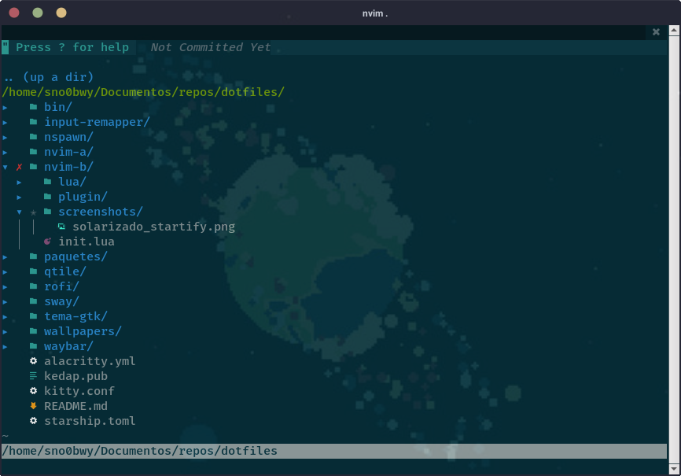
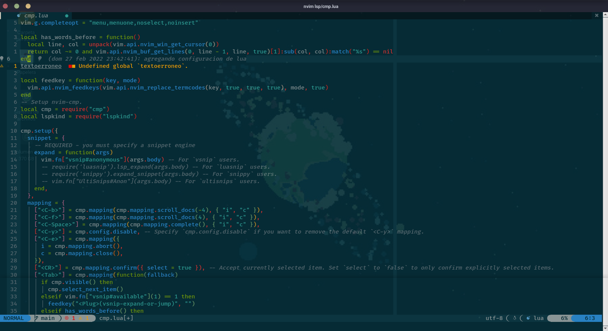
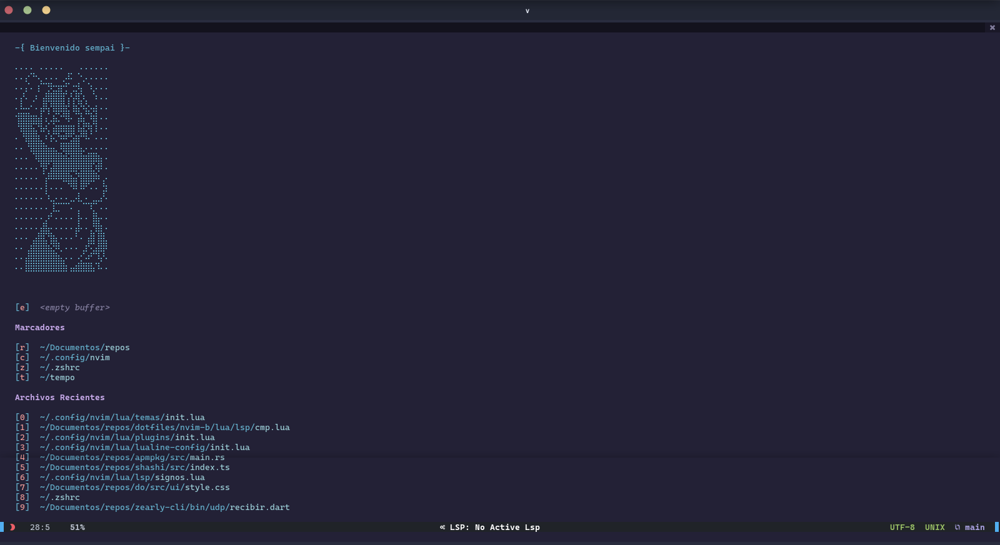

# Neovim (Lua)

Aquí la configuración de Neovim escrito en Lua

## Screenshots
---
### Solarizado
#### Startify

#### Navegando entre archivos (NERDTree)

#### Ejemplo de algún código escrito en Lua

## [Duskfox](https://github.com/EdenEast/nightfox.nvim)
### Startify

### Navegando entre archivos (NERDTree)

### Ejemplo de algún código escrito en Lua

## Plugins
Gestor de plugins: [packer](https://github.com/wbthomason/packer.nvim)

### Temas disponibles
  - [Gruvbox](https://github.com/morhetz/gruvbox)
  - [Catppuccin](https://github.com/catppuccin/nvim)
  - [Nightfox](https://github.com/EdenEast/nightfox.nvim)
  - [Tokyonight](https://github.com/folke/tokyonight.nvim)
  - [Mi adaptacion de vim-nightfly-colors](https://github.com/Kedap/vim-nightfly-guicolors)
  - [NeoSolarized](https://github.com/overcache/NeoSolarized)
  - [OneDarkPro](https://github.com/olimorris/onedarkpro.nvim)
  - [Rose Pine](https://github.com/rose-pine/neovim)

### Utilidades
  - [Lualine](https://github.com/nvim-lualine/lualine.nvim)
  - [Treesitter](https://github.com/nvim-treesitter/nvim-treesitter)
  - [Bufferline](https://github.com/akinsho/bufferline.nvim)
  - [Autopairs](https://github.com/windwp/nvim-autopairs)
  - [Nvim-Tree](https://github.com/kyazdani42/nvim-tree.lua)
  - [Autotag](https://github.com/windwp/nvim-ts-autotag)
  - [Telescope](https://github.com/nvim-telescope/telescope.nvim)
  - [Nvim-cmp](https://github.com/hrsh7th/nvim-cmp)
    - [Cpm nvim lsp](https://github.com/hrsh7th/cmp-nvim-lsp)
    - [Cmp buffer](https://github.com/hrsh7th/cmp-buffer)
    - [Cmp path](https://github.com/hrsh7th/cmp-path)
    - [Cmp calc](https://github.com/hrsh7th/cmp-calc)
    - [Cmp cmdline](https://github.com/hrsh7th/cmp-cmdline)
    - [Cmp vsnip](https://github.com/hrsh7th/cmp-vsnip)
    - [Vim vsnip](https://github.com/hrsh7th/vim-vsnip)
    - [Vim vsnip integ](https://github.com/hrsh7th/vim-vsnip-integ)
  - [LSPKind](https://github.com/onsails/lspkind-nvim)
  - [Friendly snippets](https://github.com/rafamadriz/friendly-snippets)
  - [Nvim colorizer](https://github.com/norcalli/nvim-colorizer.lua)
  - [Indent blankline](https://github.com/lukas-reineke/indent-blankline.nvim)
  - [vCoolor](https://github.com/KabbAmine/vCoolor.vim)
  - [Hop](https://github.com/phaazon/hop.nvim)
  - [AsyncTasks](https://github.com/skywind3000/asynctasks.vim)

### Integración con Git
- [gitsigns](https://github.com/lewis6991/gitsigns.nvim)
- [Vim fugitive](https://github.com/tpope/vim-fugitive)
- [Gv](https://github.com/junegunn/gv.vim)
- [Git blame](https://github.com/f-person/git-blame.nvim)

### Utilidades de código
- [Editorconfig](https://github.com/editorconfig/editorconfig-vim)
- [Formatter.nvim](https://github.com/mhartington/formatter.nvim)
- [Lspsaga](https://github.com/tami5/lspsaga.nvim)
- [Nvim lsp installer](https://github.com/williamboman/nvim-lsp-installer)
- [Nerdcommenter](https://github.com/preservim/nerdcommenter)
- [Rust tools](https://github.com/simrat39/rust-tools.nvim)
  - [Crates](https://github.com/saecki/crates.nvim)
- [Flutter](https://github.com/thosakwe/vim-flutter)
  - [Awesome flutter snippets](https://github.com/Nash0x7E2/awesome-flutter-snippets)
- [Vimtex](https://github.com/lervag/vimtex)
- [Markdown preview](https://github.com/iamcco/markdown-preview.nvim)
- [Nvim lspconfig](https://github.com/neovim/nvim-lspconfig)
- [Vimspector](https://github.com/puremourning/vimspector)

### Terminales
- [Vim Floaterm](https://github.com/voldikss/vim-floaterm)
- [Toggleterm](https://github.com/akinsho/toggleterm.nvim)

### Complementos no necesarios pero bonitos
- [Startify](https://github.com/mhinz/vim-startify)
- [Nvim ts rainbow](https://github.com/p00f/nvim-ts-rainbow)
- [Nvim web devicons](https://github.com/kyazdani42/nvim-web-devicons)
- [Vim devicons](https://github.com/ryanoasis/vim-devicons)
- [Plenary](https://github.com/nvim-lua/plenary.nvim)
- [Presenting](https://github.com/sotte/presenting.vim)
- [Notify](https://github.com/rcarriga/nvim-notify)
