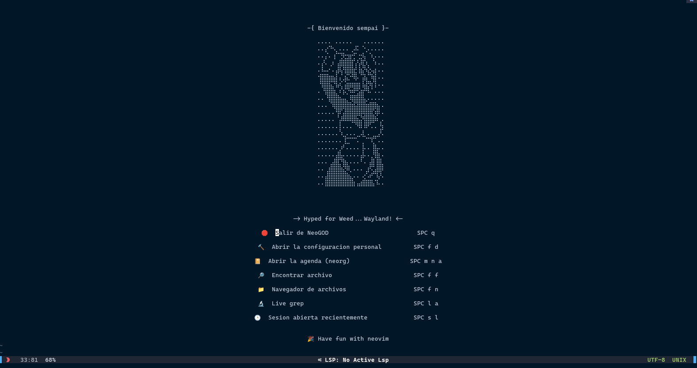
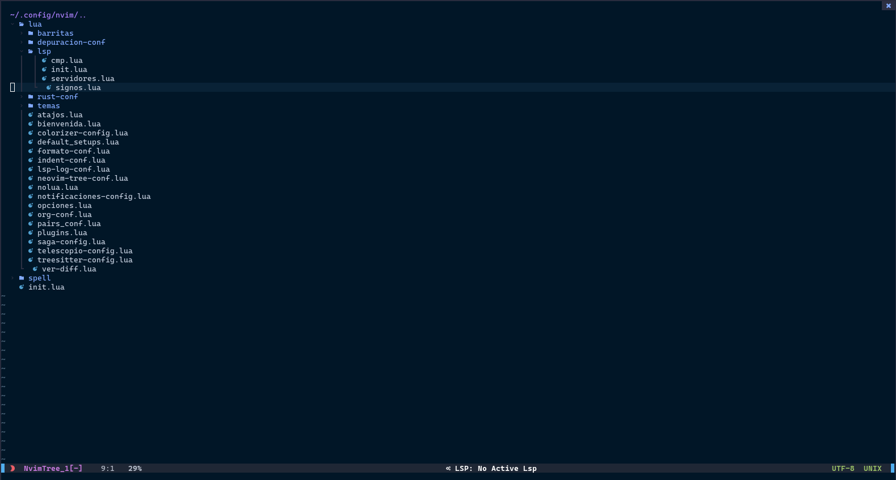
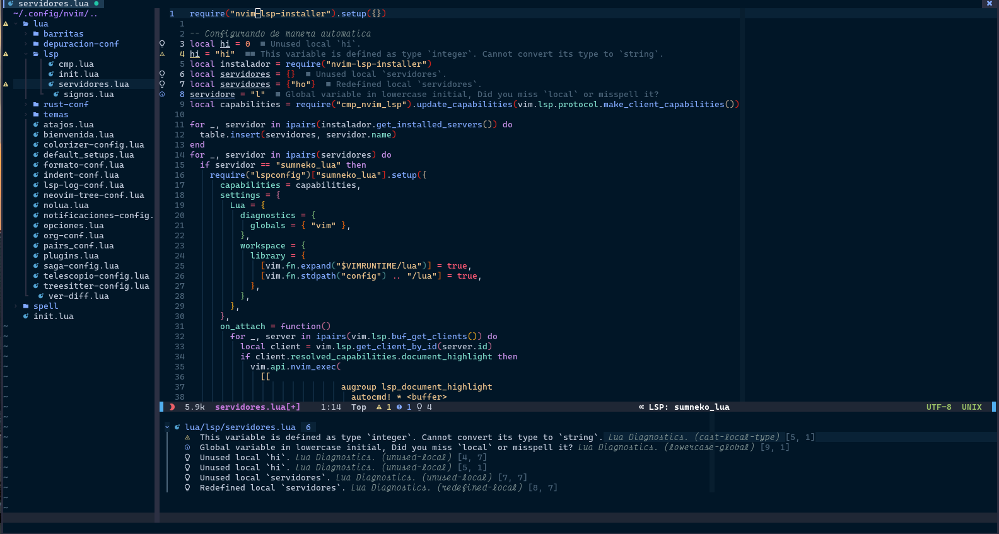
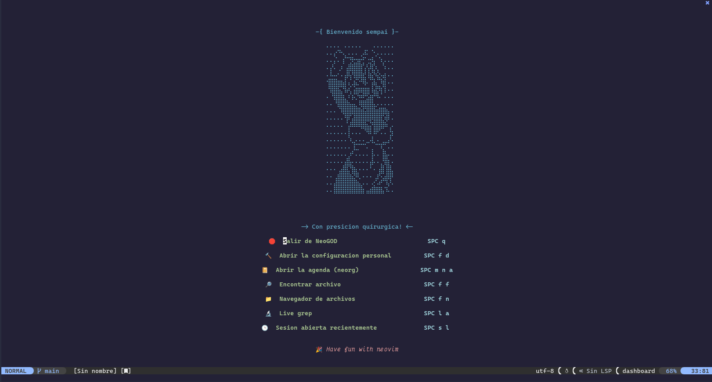
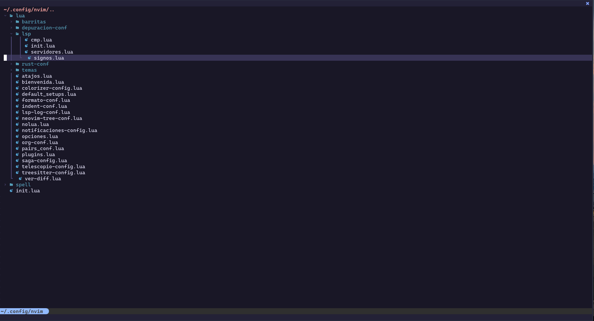
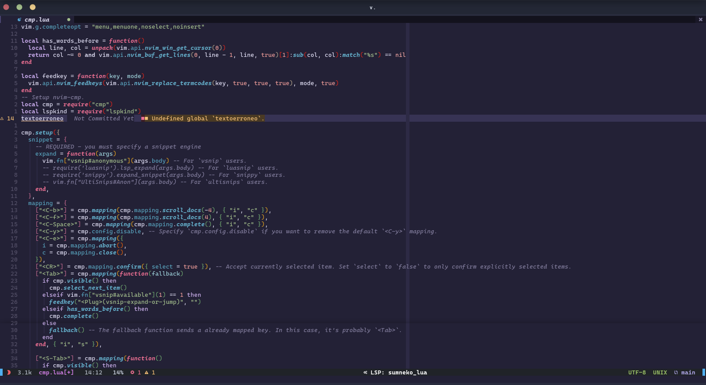

# Neovim(lua)

Aquí la configuración de Neovim escrito en Lua.

## Screenshots
---
### Nightfly
#### Dashboard

#### Navegando entre archivos

#### Ejemplo de algun codigo en lua

### Duskfox
#### Dashboard

#### Navegando entre archivos

#### Ejemplo de algun codigo en lua

## Plugins
Gestor de plugins: [packer](https://github.com/wbthomason/packer.nvim)

### Temas disponibles

- [nightfly](https://github.com/bluz71/vim-nightfly-guicolors)
- [oxocarbon](https://github.com/shaunsingh/oxocarbon.nvim)
- [kanagawa](https://github.com/rebelot/kanagawa.nvim)
- [catppuccin](https://github.com/catppuccin/nvim)
- [nightfox](https://github.com/EdenEast/nightfox.nvim)
- [onedarkpro](https://github.com/olimorris/onedarkpro.nvim)
- [rose-pine](https://github.com/rose-pine/neovim)
- [enfocado](https://github.com/wuelnerdotexe/vim-enfocado)
- [challenger-deep](https://github.com/challenger-deep-theme/vim)

### Plugins esenciales
- [impatient](https://github.com/lewis6991/impatient.nvim)
- [nvim-tree](https://github.com/kyazdani42/nvim-tree.lua)
    - [nvim-web-devicons](https://github.com/kyazdani42/nvim-web-devicons)
- [bufferline](https://github.com/akinsho/bufferline.nvim)
- [lualine](https://github.com/nvim-lualine/lualine.nvim)

### Utilizades de código
- [nvim-treesitter](https://github.com/nvim-treesitter/nvim-treesitter)
- [nvim-ts-rainbow](https://github.com/p00f/nvim-ts-rainbow)
- [nvim-ts-autotag](https://github.com/windwp/nvim-ts-autotag)
- [vim-surround](https://github.com/tpope/vim-surround)
- [editorconfig-vim](https://github.com/editorconfig/editorconfig-vim)
- [formatter.nvim](https://github.com/mhartington/formatter.nvim)

### Depuración
- [nvim-dap-ui](https://github.com/rcarriga/nvim-dap-ui)
- [nvim-dap-python](https://github.com/mfussenegger/nvim-dap-python)
- [nvim-dap](https://github.com/mfussenegger/nvim-dap)

### LSP
- [lspsaga.nvim](https://github.com/kkharji/lspsaga.nvim)
    - [nvim-lspconfig](https://github.com/neovim/nvim-lspconfig)
- [nvim-lsp-installer](https://github.com/williamboman/nvim-lsp-installer)
- [lspkind-nvim](https://github.com/onsails/lspkind-nvim)
- [trouble.nvim](https://github.com/folke/trouble.nvim)

### LSP autocompletado
- [nvim-cmp](https://github.com/hrsh7th/nvim-cmp)
    - [cmp-nvim-lsp](https://github.com/hrsh7th/cmp-nvim-lsp)
    - [cmp-buffer](https://github.com/hrsh7th/cmp-buffer)
    - [cmp-path](https://github.com/hrsh7th/cmp-path)
    - [cmp-calc](https://github.com/hrsh7th/cmp-calc)
    - [cmp-cmdline](https://github.com/hrsh7th/cmp-cmdline)
    - [nvim-cmp](https://github.com/hrsh7th/nvim-cmp)
    - [cmp-vsnip](https://github.com/hrsh7th/cmp-vsnip)
    - [vim-vsnip](https://github.com/hrsh7th/vim-vsnip)
    - [vim-vsnip-integ](https://github.com/hrsh7th/vim-vsnip-integ)
    - [cmp-spell](https://github.com/f3fora/cmp-spell)
    - [friendly-snippets](https://github.com/rafamadriz/friendly-snippets)

### Herramientas de lenguaje
- [rust-tools.nvim](https://github.com/simrat39/rust-tools.nvim)
    - [crates.nvim](https://github.com/saecki/crates.nvim)
    - [plenary.nvim](https://github.com/nvim-lua/plenary.nvim)
- [rust-tools.nvim](https://github.com/simrat39/rust-tools.nvim)
- [vimtex](https://github.com/lervag/vimtex)
- [markdown-preview.nvim](https://github.com/iamcco/markdown-preview.nvim)
- [vim-flutter](https://github.com/thosakwe/vim-flutter)

### GIT
- [neogit](https://github.com/TimUntersberger/neogit)
    - [diffview.nvim](https://github.com/sindrets/diffview.nvim)
- [gitsigns.nvim](https://github.com/lewis6991/gitsigns.nvim)
- [vim-fugitive](https://github.com/tpope/vim-fugitive)

### Cosas bonitas y **casi** necesarias
- [nvim-autopairs](https://github.com/windwp/nvim-autopairs)
- [nvim-colorizer.lua](https://github.com/norcalli/nvim-colorizer.lua)
- [indent-blankline.nvim](https://github.com/lukas-reineke/indent-blankline.nvim)
- [telescope.nvim](https://github.com/nvim-telescope/telescope.nvim)
- [nvim-notify](https://github.com/rcarriga/nvim-notify)
- [vCoolor.vim](https://github.com/KabbAmine/vCoolor.vim)
- [hop.nvim](https://github.com/phaazon/hop.nvim)
- [tagalong.vim](https://github.com/AndrewRadev/tagalong.vim)
- [vim-repeat](https://github.com/tpope/vim-repeat)
- [nvim-comment](https://github.com/terrortylor/nvim-comment)
- [undotree](https://github.com/mbbill/undotree)

### Atajos
- [which-key.nvim](https://github.com/folke/which-key.nvim)

### Terminales
- [vim-floaterm](https://github.com/voldikss/vim-floaterm)
- [toggleterm.nvim](https://github.com/akinsho/toggleterm.nvim)

### Cosas no necesarias pero bonitas
- [neorg](https://github.com/nvim-neorg/neorg)
- [dashboard-nvim](https://github.com/glepnir/dashboard-nvim)

# Dependencias

Necesarios:
- [kitty](https://github.com/kovidgoyal/kitty) (terminal y no necesario pero se
  ve mas bonito) tambien es recomendable utilizar la
  [config](https://github.com/Kedap/dotfiles/blob/main/kitty.conf) de mi repo.
  Lo imporante es que tenga soporte con ligaturas
  - [Cascadia code font](https://github.com/microsoft/cascadia-code) es la fuente que utilzo junto a
  - [Victor mono](https://rubjo.github.io/victor-mono/)
  - [noto-fonts-emoji](https://github.com/googlefonts/noto-emoji) para emojis en al terminal

- Rust (para compilar oxocarbon)
- Yarn
- Git
- Ripgrep
- [Mis
  splashes](https://github.com/Kedap/dotfiles/blob/main/wallpapers/splashes),
  justo en `~/Wallpapers/splashes` (lo puedes configurar despues)

No necesarios, a menos que utilices algo de la lista o plugins
- Zenity (para seleccionar colores)
- Formatos
  - Prettier (instalado de manera global)
  - rustfmt
  - stylua
  - shfmt
  - latexindent

- Depuradores
  - [debugpy](https://github.com/mfussenegger/nvim-dap-python) haga click para
    mejor informacion (la configuracion esta hecha para que el directorio sea
    `~/.virtualenvs/debugpy/bin/python`)
  - [lldb-vscode | lldb](https://github.com/mfussenegger/nvim-dap/wiki/Debug-Adapter-installation#ccrust-via-lldb-vscode)

- Algo que instale pdflatex
- Firefox para ver los archivos Markdown
