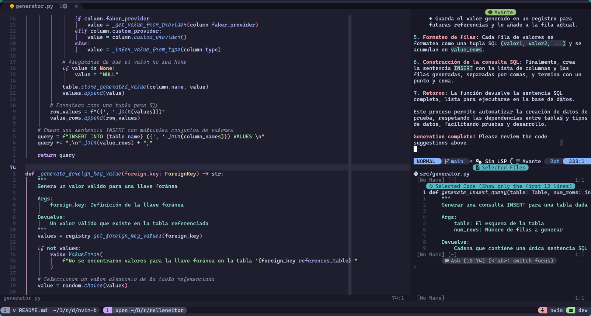

# Neovim (lua)

Aquí se puede ver la configuración escrito en este lenguaje

## Capturas de pantalla

## Plugins

El gestor de plugins que se utiliza es: [Lazy](https://github.com/folke/lazy.nvim)

### Temas disponibles

- [nightfly-colors](https://github.com/bluz71/vim-nightfly-colors)
- [oxocarbon](https://github.com/shaunsingh/oxocarbon.nvim)
- [kanagawa](https://github.com/rebelot/kanagawa.nvim)
- [catppuccin](https://github.com/catppuccin/nvim)
- [onedarkpro](https://github.com/olimorris/onedarkpro.nvim)
- [rose-pine](https://github.com/rose-pine/neovim)
- [vim-enfocado](https://github.com/wuelnerdotexe/vim-enfocado)
- [challenger-deep](https://github.com/challenger-deep-theme/vim)
- [gruvbox](https://github.com/ellisonleao/gruvbox.nvim)
- [gruvbox](https://github.com/morhetz/gruvbox)
- [night](https://github.com/NightCS/night.nvim)
- [everblush](https://github.com/Everblush/everblush.nvim)
- [tokyonight](https://github.com/folke/tokyonight.nvim)
- [nvim-tundra](https://github.com/sam4llis/nvim-tundra)
- [zephyr](https://github.com/glepnir/zephyr-nvim)
- [nordic](https://github.com/AlexvZyl/nordic.nvim)
- [oh-lucy](https://github.com/Yazeed1s/oh-lucy.nvim)
- [neovim-ayu](https://github.com/Shatur/neovim-ayu)
- [ayu](https://github.com/ayu-theme/ayu-vim)
- [palenightfall](https://github.com/JoosepAlviste/palenightfall.nvim)
- [bluloco](https://github.com/uloco/bluloco.nvim)
- [sweetie](https://github.com/NTBBloodbath/sweetie.nvim)
- [monokai-pro](https://gitlab.com/__tpb/monokai-pro.nvim)
- [nightfox](https://github.com/EdenEast/nightfox.nvim)
- [eldritch](https://github.com/eldritch-theme/eldritch.nvim)
- [monet](https://github.com/fynnfluegge/monet.nvim)
- [neofusion](https://github.com/diegoulloao/neofusion.nvim)
- [oldworld](https://github.com/dgox16/oldworld.nvim)

### Cosas **esenciales**

- [nvim-tree](https://github.com/nvim-tree/nvim-tree.lua)
- [oil](https://github.com/stevearc/oil.nvim)
- [nvim-web-devicons](https://github.com/nvim-tree/nvim-web-devicons)
- [bufferline](https://github.com/akinsho/bufferline.nvim)
- [lualine](https://github.com/nvim-lualine/lualine.nvim)
- [vim-tmux-navigator](https://github.com/christoomey/vim-tmux-navigator)
- [rest.nvim](https://github.com/rest-nvim/rest.nvim)

### Base de datos

- [vim-dadbod](https://github.com/tpope/vim-dadbod)
- [vim-dadbod-ui](https://github.com/kristijanhusak/vim-dadbod-ui)
- [vim-dadbod-completion](https://github.com/kristijanhusak/vim-dadbod-completion)
- [vim-dotenv](https://github.com/tpope/vim-dotenv)

### Utilidades de código

- [treesitter](https://github.com/nvim-treesitter/nvim-treesitter)
  - [nvim-ts-rainbow](https://github.com/p00f/nvim-ts-rainbow)
  - [nvim-ts-autotag](https://github.com/windwp/nvim-ts-autotag)
  - [nvim-treesitter-textobjects](https://github.com/nvim-treesitter/nvim-treesitter-textobjects)
  - [nvim-treesitter-refactor](https://github.com/nvim-treesitter/nvim-treesitter-refactor)
- [vim-surround](https://github.com/tpope/vim-surround)
- [formatter](https://github.com/mhartington/formatter.nvim)

### Depuración

- [nvim-dap](https://github.com/mfussenegger/nvim-dap)

  - [nvim-dap-ui](https://github.com/rcarriga/nvim-dap-ui)
  - [nvim-dap-virtual-text](https://github.com/theHamsta/nvim-dap-virtual-text)
  - [nvim-dap-python](https://github.com/mfussenegger/nvim-dap-python)
  - [nvim-dap-vscode-js](https://github.com/mxsdev/nvim-dap-vscode-js)
  - [nvim-dap-ruby](https://github.com/suketa/nvim-dap-ruby)
  - [nvim-dap-go](https://github.com/leoluz/nvim-dap-go)

  - [telescope-dap.nvim](https://github.com/nvim-telescope/telescope-dap.nvim)
  - [cmp-dap](https://github.com/rcarriga/cmp-dap)

### LSP

- [mason.nvim](https://github.com/williamboman/mason.nvim)

  - [mason-lspconfig.nvim](https://github.com/williamboman/mason-lspconfig.nvim)
  - [nvim-lspconfig](https://github.com/neovim/nvim-lspconfig)
  - [cmp-nvim-lsp](https://github.com/hrsh7th/cmp-nvim-lsp)
  - [lsp_signature.nvim](https://github.com/ray-x/lsp_signature.nvim)
  - [nvim-ufo](https://github.com/kevinhwang91/nvim-ufo)

- [lspsaga.nvim](https://github.com/glepnir/lspsaga.nvim)
- [fidget.nvim](https://github.com/j-hui/fidget.nvim)
- [trouble.nvim](https://github.com/folke/trouble.nvim)

### Completado

- [nvim-cmp](https://github.com/hrsh7th/nvim-cmp)
  - [nvim-lspconfig](https://github.com/neovim/nvim-lspconfig)
  - [cmp-nvim-lsp](https://github.com/hrsh7th/cmp-nvim-lsp)
  - [cmp-buffer](https://github.com/hrsh7th/cmp-buffer)
  - [cmp-path](https://github.com/hrsh7th/cmp-path)
  - [cmp-calc](https://github.com/hrsh7th/cmp-calc)
  - [cmp-cmdline](https://github.com/hrsh7th/cmp-cmdline)
  - [nvim-cmp](https://github.com/hrsh7th/nvim-cmp)
  - [cmp-vsnip](https://github.com/hrsh7th/cmp-vsnip)
  - [vim-vsnip](https://github.com/hrsh7th/vim-vsnip)
  - [vim-vsnip-integ](https://github.com/hrsh7th/vim-vsnip-integ)
  - [cmp-spell](https://github.com/f3fora/cmp-spell)
  - [lspkind-nvim](https://github.com/onsails/lspkind-nvim)
  - [friendly-snippets](https://github.com/rafamadriz/friendly-snippets)
  - [cmp-git](https://github.com/petertriho/cmp-git)
  - [cmp-emoji](https://github.com/hrsh7th/cmp-emoji)

### IA

- [codeium](https://github.com/Exafunction/codeium.nvim)
- [avante](https://github.com/yetone/avante.nvim)

### Herramientas de lenguaje

- [rustaceanvim](https://github.com/mrcjkb/rustaceanvim)
  - [crates](https://github.com/saecki/crates.nvim)
  - [plenary](https://github.com/nvim-lua/plenary.nvim)
- [vimtex](https://github.com/lervag/vimtex)
- [markdown-preview](https://github.com/iamcco/markdown-preview.nvim)
- [go](https://github.com/ray-x/go.nvim)
- [nvim-jdtls](https://github.com/mfussenegger/nvim-jdtls)

### GIT

- [neogit](https://github.com/NeogitOrg/neogit)
- [diffview](https://github.com/sindrets/diffview.nvim)
- [gitsigns](https://github.com/lewis6991/gitsigns.nvim)
- [vim-fugitive](https://github.com/tpope/vim-fugitive)
- [git-conflict.nvim](https://github.com/akinsho/git-conflict.nvim)

### Cosas bonitas y **casi** necesarias

- [nvim-autopairs](https://github.com/windwp/nvim-autopairs)
- [nvim-colorizer.lua](https://github.com/norcalli/nvim-colorizer.lua)
- [telescope](https://github.com/nvim-telescope/telescope.nvim)
- [nvim-notify](https://github.com/rcarriga/nvim-notify)
- [volt](https://github.com/nvzone/volt)
- [minty](https://github.com/nvzone/minty)
- [hop.nvim](https://github.com/phaazon/hop.nvim)
- [tagalong.vim](https://github.com/AndrewRadev/tagalong.vim)
- [vim-repeat](https://github.com/tpope/vim-repeat)
- [nvim-comment](https://github.com/terrortylor/nvim-comment)
- [undotree](https://github.com/mbbill/undotree)
- [nabla](https://github.com/nvim-tree/nvim-web-devicons)
- [nvim-silicon](https://github.com/michaelrommel/nvim-silicon)
- [snacks](https://github.com/folke/snacks.nvim)
- [todo-comments.nvim](https://github.com/folke/todo-comments.nvim)

### Atajos

- [which-key](https://github.com/folke/which-key.nvim)

### Terminales utilizados

- [vim-floaterm](https://github.com/voldikss/vim-floaterm)
- [toggleterm](https://github.com/akinsho/toggleterm.nvim)

### Cosas no necesarias pero bonitas

- [dashboard](https://github.com/glepnir/dashboard-nvim)

Si alguno de los plugins no esta puedes consultar los archivos de la
configuración o el archivo [Lazy](#lazy-lockjson)

# Dependencias

**NECESARIO**:

- [kitty](https://github.com/kovidgoyal/kitty), no es necesario pero es para
  que se vea bonito, el concepto es que tenga soporte para ligaduras, imagenes
  o mostrar pictogramas como las NerdFonts. se puede consultar mi
  [config](https://github.com/Kedap/dotfiles/blob/main/kitty.conf) con soporte
  para ligaturas.
  - [Cascadia code](https://github.com/microsoft/cascadia-code) Es la fuente
    que utilizo, puede utilizar otra o una NerdFont, también lo utilizo junto a
  - [Victor Mono](https://rubjo.github.io/victor-mono/)
  - [noto-emoji](https://github.com/googlefonts/noto-emoji) Para soportar los
    emojis
- Rust
- Yarn y NPM
- Ripgrep
- [Mis
  splashes](https://github.com/Kedap/dotfiles/blob/main/wallpapers/splashes),
  Deben de estar justo en `~/Wallpapers/splashes` (se puede modificar después
  la ruta)
- Git :)

**No necesarios a menos que lo utilices**

- Programas de formatear que no se encuentran en
  [mason](https://github.com/williamboman/mason.nvim)
  - Latexindent configuración de depurador
    - [nvim-dap-python](https://github.com/mfussenegger/nvim-dap-python) haga
      click para mas información (la configuración esta hecha para ser que el
      directorio sea `~/.virtualenvs/debugpy/bin/python`) Algo que instale
      LaTeX (`pdflatex`)
- Firefox
